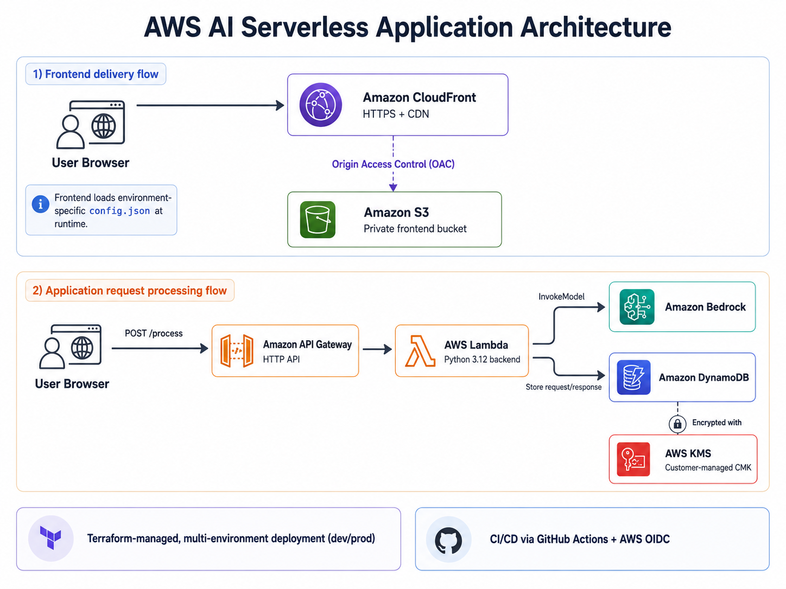
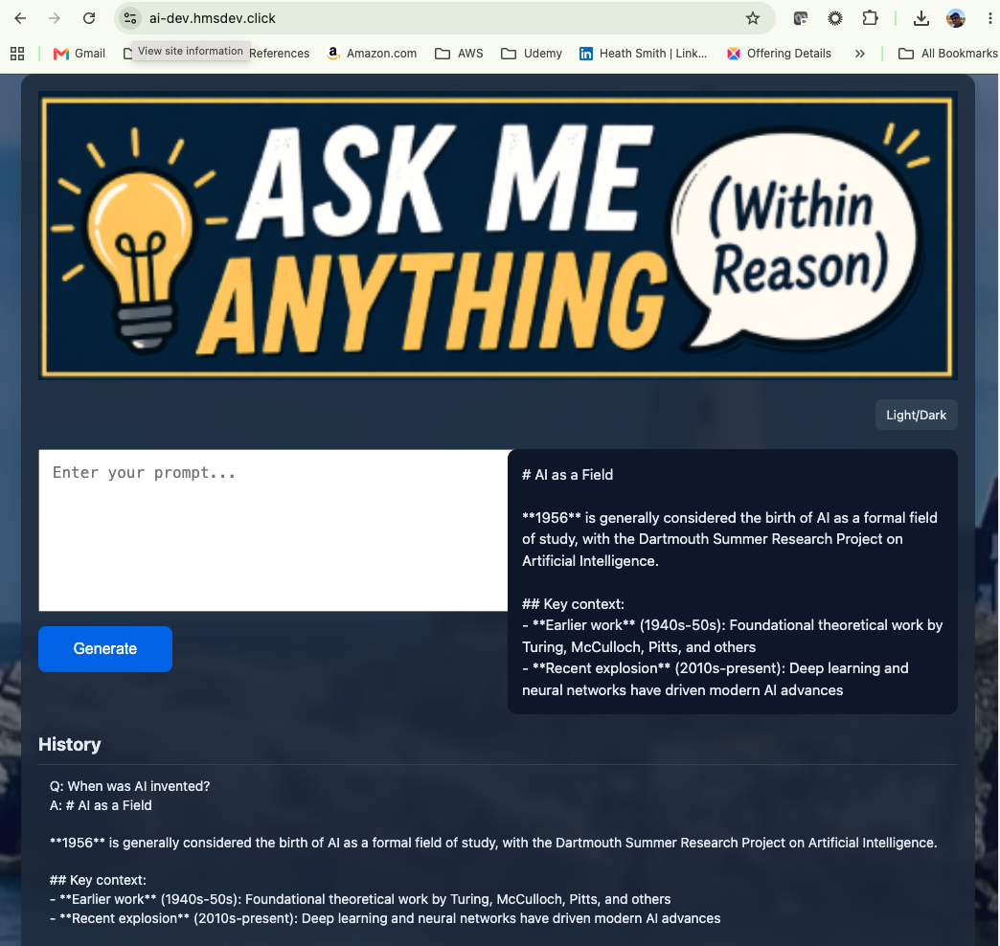

# AWS AI Serverless Application

A production-style serverless AI application built on AWS and provisioned with Terraform. The project demonstrates secure static frontend delivery, a managed serverless API, generative AI integration with Amazon Bedrock, encrypted persistence in DynamoDB, multi-environment infrastructure, and controlled CI/CD through GitHub Actions and AWS OIDC.

The application accepts a prompt from a browser-based frontend, sends it through an API Gateway HTTP API to AWS Lambda, invokes an Amazon Bedrock foundation model, persists the interaction in DynamoDB, and returns the generated response to the user.

## Architecture



CloudFront provides the public HTTPS entry point for the static frontend while the S3 origin remains private through Origin Access Control (OAC). The browser calls an API Gateway HTTP API, which invokes a Python 3.12 Lambda function. Lambda orchestrates the Bedrock model invocation and persists application data in a DynamoDB table encrypted with a customer-managed AWS KMS key.

## Request Flow

1. A user loads the application through CloudFront over HTTPS.
2. CloudFront retrieves the static frontend from a private S3 bucket using OAC.
3. The frontend loads an environment-specific `config.json` file containing the API endpoint.
4. The user submits a prompt to the API Gateway HTTP API.
5. API Gateway invokes the Lambda backend.
6. Lambda sends the prompt to Amazon Bedrock.
7. Lambda stores the interaction in DynamoDB.
8. The generated response is returned through API Gateway to the frontend.

## Application Preview



The browser-based frontend submits prompts to the API Gateway HTTP API and displays responses generated through Amazon Bedrock.

## Key Design Decisions

### Serverless application architecture

API Gateway, Lambda, DynamoDB, S3, CloudFront, and Bedrock are managed services that minimize infrastructure administration and allow the application to scale without maintaining persistent compute capacity.

This also makes the project practical as a portfolio workload because environments can be deployed for testing and destroyed when they are no longer needed.

### Private S3 origin with CloudFront OAC

The frontend bucket is not exposed as a public website. CloudFront accesses the private S3 origin through Origin Access Control, keeping direct public S3 access blocked while still providing HTTPS delivery and CDN caching.

### API Gateway HTTP API

The backend is exposed through an API Gateway HTTP API rather than directly exposing the Lambda function. This provides a managed application endpoint and cleanly separates the browser-facing API layer from backend compute.

### Amazon Bedrock

Amazon Bedrock provides managed access to foundation models without requiring model hosting or inference infrastructure. Lambda invokes the configured model and handles the application-specific request and response processing.

### DynamoDB with customer-managed KMS encryption

Application data is stored in DynamoDB using on-demand billing. The table is encrypted with a customer-managed AWS KMS key, demonstrating explicit control of encryption at rest rather than relying solely on service-default encryption.

### Runtime frontend configuration

The frontend does not hard-code an environment-specific API Gateway URL into the application source.

Terraform generates `config.json` directly using `jsonencode()` and uploads it to the frontend S3 bucket:

```text
API Gateway endpoint
        │
        ▼
     Terraform
     jsonencode()
        │
        ▼
  S3 config.json
        │
        ▼
Frontend loads configuration at runtime
```

This allows the same frontend source to work with independently deployed development and production environments.

### Multi-environment design

Development and production use separate Terraform roots and independent remote state:

```text
terraform/
├── environments/
│   ├── dev/
│   └── prod/
└── modules/
```

Environment-specific configuration is kept at the root level while reusable infrastructure is implemented through Terraform modules.

## Terraform Architecture

The project uses reusable modules for the primary application components:

```text
terraform/modules/
├── apigateway/
├── dynamodb/
├── frontend/
├── iam/
├── lambda/
└── s3/
```

The environment roots compose these modules to create complete deployments.

Terraform requirements are standardized across the environments:

- Terraform `>= 1.15.0`
- AWS provider `~> 6.0`
- Dependency lockfiles are committed for reproducible provider selection

### Remote state

Terraform state is stored remotely in the portfolio AWS account rather than in the repository.

The environments use separate state keys in the shared S3 backend:

```text
hms-terraform-state-portfolio
├── ai-serverlessapp/dev/terraform.tfstate
└── ai-serverlessapp/prod/terraform.tfstate
```

S3 native state locking is enabled with `use_lockfile = true`, helping prevent concurrent Terraform operations against the same environment.

## CI/CD with GitHub Actions

Infrastructure workflows authenticate to AWS using GitHub Actions OIDC and the shared portfolio deployment role:

```text
hms-github-actions-terraform-role
```

No long-lived AWS access keys are stored in GitHub for Terraform deployment.

A reusable composite action standardizes Terraform setup, AWS authentication, initialization, formatting checks, and validation.

### Pull request plan

Infrastructure changes are reviewed through the pull request workflow:

```text
Pull Request
     │
     ▼
AWS OIDC authentication
     │
     ▼
terraform init
     │
     ├── terraform fmt -check
     ├── terraform validate
     └── terraform plan
              │
              ▼
        Plan added to PR
```

This provides infrastructure review before changes reach `main`.

### Controlled apply

Apply is performed through a manually triggered GitHub Actions workflow with an explicit environment selection.

The workflow:

1. authenticates to AWS through OIDC;
2. initializes the selected Terraform environment;
3. creates a Terraform plan;
4. applies the exact saved plan; and
5. uses the Terraform CloudFront distribution output to invalidate cached frontend content.

### Controlled destroy

Destruction is intentionally separated into planning and execution.

The workflow requires explicit destroy confirmation, generates a destroy plan for review, uploads that saved plan as a workflow artifact, and applies the reviewed artifact during the execution stage.

This prevents an unreviewed `terraform destroy -auto-approve` operation from being the normal CI/CD destruction path.

## Security

The project incorporates several controls intended to demonstrate practical AWS security patterns:

- GitHub Actions authenticates to AWS through OIDC instead of stored AWS access keys.
- The frontend S3 bucket blocks public access.
- CloudFront accesses S3 through Origin Access Control.
- HTTPS is used for frontend delivery.
- IAM policies scope Lambda access to the AWS resources required by the application.
- DynamoDB is encrypted using a customer-managed KMS key.
- Terraform state is stored remotely rather than committed to Git.
- Development and production maintain independent Terraform state and resources.

## Repository Structure

```text
.
├── .github/
│   ├── actions/
│   │   └── terraform-setup/
│   └── workflows/
│       ├── terraform-plan.yml
│       ├── terraform-apply.yml
│       └── terraform-destroy.yml
├── app/
│   └── lambda/
├── frontend/
├── terraform/
│   ├── environments/
│   │   ├── dev/
│   │   └── prod/
│   └── modules/
│       ├── apigateway/
│       ├── dynamodb/
│       ├── frontend/
│       ├── iam/
│       ├── lambda/
│       └── s3/
└── README.md
```

## Lambda packaging

Terraform deploys the tracked Lambda archive rather than packaging `handler.py` automatically. Keep the source and archive synchronized so local tests exercise the same code that Terraform deploys. Review and commit `handler.py` and `lambda.zip` together.

Verify the archive without modifying it:

```bash
python3 scripts/package_lambda.py check
```

Regenerating `app/lambda/package/lambda.zip` requires explicit approval. After approval, build the deterministic archive with:

```bash
python3 scripts/package_lambda.py build
```

## Deployment

GitHub Actions is the preferred deployment path because it exercises the same OIDC authentication and controlled Terraform lifecycle used for repository changes.

The infrastructure can also be planned locally when AWS credentials for the portfolio account are available.

For development:

```bash
cd terraform/environments/dev
AWS_PROFILE=portfolio terraform init
AWS_PROFILE=portfolio terraform validate
AWS_PROFILE=portfolio terraform plan
```

For production:

```bash
cd terraform/environments/prod
AWS_PROFILE=portfolio terraform init
AWS_PROFILE=portfolio terraform validate
AWS_PROFILE=portfolio terraform plan
```

Review Terraform plans before applying infrastructure changes.

## Teardown

Development and production environments are designed to be destroyable when not in use.

The preferred teardown path is the controlled GitHub Actions destroy workflow, which separates destroy planning from execution and requires explicit confirmation.

For local administrative use, Terraform can also generate a destroy plan from the appropriate environment root:

```bash
AWS_PROFILE=portfolio terraform plan -destroy
```

A destroy plan should always be reviewed before execution.

## Validation

The application lifecycle has been validated through both Terraform and functional testing.

Validation performed during development has included:

- successful Terraform initialization and validation;
- review of Terraform plans before deployment;
- successful infrastructure deployment through the portfolio AWS account;
- DNS resolution of the development application domain;
- successful HTTPS delivery through CloudFront;
- direct verification of the CloudFront endpoint;
- API Gateway behavior verification;
- manual end-to-end application testing;
- successful Amazon Bedrock invocation;
- verification that application data was written to DynamoDB;
- verification of DynamoDB KMS encryption;
- direct verification of the generated frontend `config.json`;
- Terraform convergence testing with `terraform plan -detailed-exitcode`;
- controlled environment destruction; and
- post-destroy verification of Terraform state and DNS.

The final convergence test returned exit code `0`, confirming that the deployed development infrastructure matched the Terraform configuration before teardown.

## Cost Considerations

The architecture favors managed, usage-based AWS services and supports destroying environments when they are not needed.

Primary cost considerations include:

- Lambda invocation and execution duration;
- API Gateway requests;
- Amazon Bedrock inference;
- DynamoDB request/storage usage;
- CloudFront requests and data transfer;
- S3 storage and requests;
- Route 53 hosted-zone and DNS charges; and
- AWS KMS key usage.

The development environment is intentionally deployed on demand rather than kept running continuously.

## Demo Endpoints

When the corresponding environment is deployed:

- **Production:** https://ai.hmsdev.click
- **Development:** https://ai-dev.hmsdev.click

> These are on-demand portfolio environments and may be intentionally offline when not in use to control AWS costs.

## Author

Heath Smith
